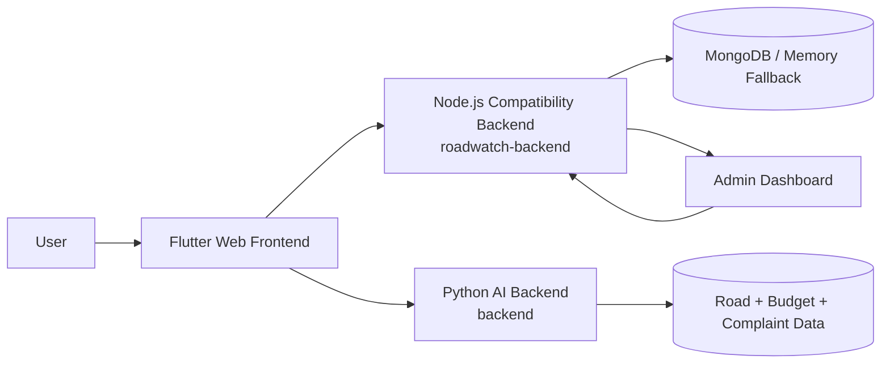

# RoadWatch AI

RoadWatch AI is a civic road monitoring platform for hackathon demos. It combines a Flutter web app, a Node.js compatibility backend, a Python AI backend, and a React admin dashboard to cover road discovery, reporting, chatbot assistance, image analysis, and live operations monitoring.

## Features

- District road explorer with road scoring and live selection sync.
- AI assistant for road context, complaints, contractor, and budget questions.
- Road image analysis for damage detection.
- Complaint generation and complaint history persistence.
- Live location and district auto-selection support.
- Admin dashboard with realtime reports, activity, and system health.

## Architecture



## Project Layout

- `frontend/` Flutter web app.
- `roadwatch-backend/` Node.js/Express backend for auth, complaints, chat, compatibility routes, and admin APIs.
- `backend/` Python FastAPI backend for AI and supporting civic APIs.
- `admin-dashboard/` React + Vite dashboard for live ops and moderation.
- `docs/` setup, architecture, API, and demo notes.

## Installation

### 1. Node compatibility backend

```bash
cd roadwatch-backend
npm install
npm start
```

### 2. Python backend

```bash
cd backend
python -m venv .venv
.venv\Scripts\activate
pip install -r requirements.txt
uvicorn app.main:app --host 127.0.0.1 --port 8000
```

### 3. Flutter frontend

```bash
cd frontend
flutter pub get
flutter run -d chrome --web-port 3000
```

### 4. Admin dashboard

```bash
cd admin-dashboard
npm install
npm run dev -- --host 127.0.0.1 --port 5173
```

## Backend Startup

The Node backend is the primary compatibility service used by the Flutter app.

```bash
cd roadwatch-backend
npm start
```

Backend health:

```bash
http://127.0.0.1:8001/health
```

## Frontend Startup

```bash
cd frontend
flutter run -d chrome --web-port 3000
```

The frontend talks to the Node backend by default at `http://127.0.0.1:8001`.

## Admin Dashboard Startup

```bash
cd admin-dashboard
npm run dev -- --host 127.0.0.1 --port 5173
```

Dashboard URL:

- `http://127.0.0.1:5173/`

## Environment Variables

### Node backend (`roadwatch-backend/.env`)

- `PORT`
- `MONGODB_URI`
- `JWT_SECRET`
- `JWT_EXPIRES_IN`
- `REFRESH_TOKEN_EXPIRES_IN_DAYS`
- `FRONTEND_URL`
- `CORS_ORIGINS`
- `UPLOAD_DIR`
- `MONITOR_ALLOW_INSECURE`
- `SEED_SAMPLE_DATA`
- `RATE_LIMIT_WINDOW_MS`
- `RATE_LIMIT_MAX`
- `CSRF_ENABLED`
- `COOKIE_DOMAIN`
- `ADMIN_EMAIL`
- `ADMIN_PASSWORD`
- `LOG_LEVEL`

### Python backend (`backend/.env`)

- `MONGODB_URI`
- `GOOGLE_API_KEY`
- `OPENAI_API_KEY`
- `GROQ_API_KEY`
- `NODE_ENV`
- `PORT`
- `API_HOST`
- `API_PORT`

### Flutter frontend

- `API_URL` via `--dart-define=API_URL=http://127.0.0.1:8001`

## Default Admin Login

If the seed data is enabled, the default admin credentials are:

- Email: `admin@roadwatch.local`
- Password: `Admin@12345`

## Verification Checklist

- Backend health endpoint: verified.
- Login flow: verified.
- Road explorer and road score updates: verified.
- Live location auto-select: verified in browser flow.
- Chatbot: verified.
- Image analysis: verified.
- Complaint generation and complaint history: verified.
- Admin dashboard: verified.

## Screenshots

Add hackathon screenshots here before submission.

## Notes

- The repo is designed to run in demo mode with seeded civic data when MongoDB is unavailable.
- Keep `.env` files out of Git and store deployment secrets in your hosting provider.